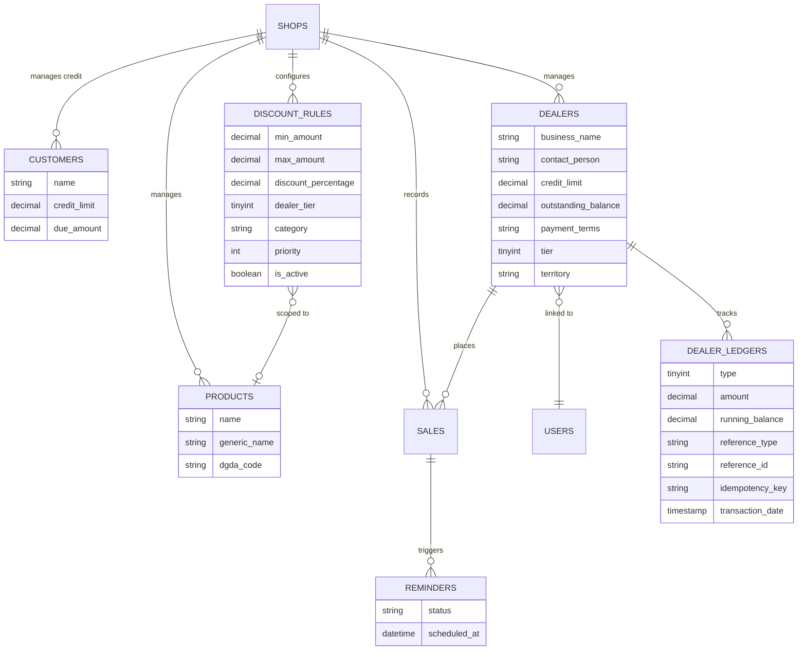

```mermaid
erDiagram
    SHOPS ||--o{ CUSTOMERS : "manages credit"
    CUSTOMERS {
        string name
        decimal credit_limit
        decimal due_amount
    }
    SHOPS ||--o{ PRODUCTS : "manages"
    PRODUCTS {
        string name
        string generic_name
        string dgda_code
    }
    SHOPS ||--o{ SALES : "records"
    SALES ||--o{ REMINDERS : "triggers"
    REMINDERS {
        string status
        datetime scheduled_at
    }

    SHOPS ||--o{ DEALERS : "manages"
    DEALERS {
        string business_name
        string contact_person
        decimal credit_limit
        decimal outstanding_balance
        string payment_terms
        tinyint tier
        string territory
    }
    DEALERS }o--|| USERS : "linked to"
    DEALERS ||--o{ DEALER_LEDGERS : "tracks"
    DEALER_LEDGERS {
        tinyint type
        decimal amount
        decimal running_balance
        string reference_type
        string reference_id
        string idempotency_key
        timestamp transaction_date
    }

    SHOPS ||--o{ DISCOUNT_RULES : "configures"
    DISCOUNT_RULES {
        decimal min_amount
        decimal max_amount
        decimal discount_percentage
        tinyint dealer_tier
        string category
        int priority
        boolean is_active
    }
    DISCOUNT_RULES }o--o| PRODUCTS : "scoped to"

    DEALERS ||--o{ SALES : "places"
```
