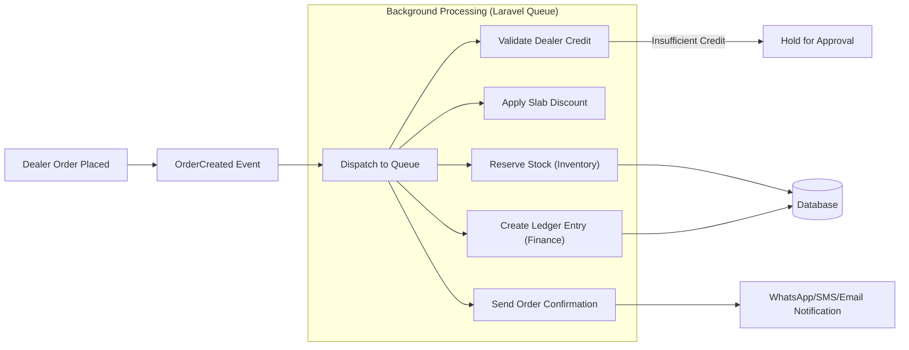
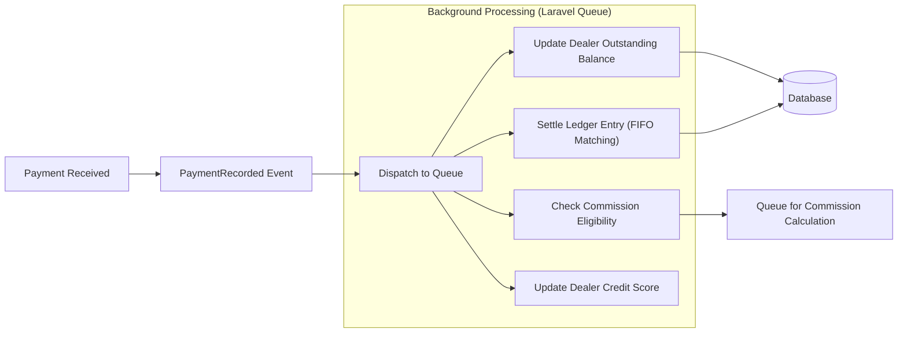
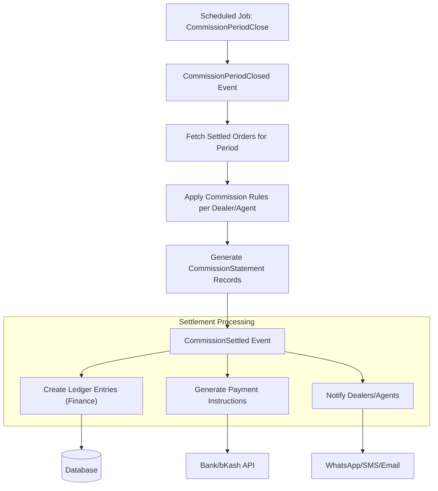

# 🔄 Sutra Event Engine — B2B Distribution Flows

The Event Engine is the asynchronous backbone of Sutra's distribution system. All high-volume operations — stock mutations, ledger entries, commission calculations, and settlement — are processed via Laravel Queues backed by Redis.

---

## 1. Order Fulfillment Flow

---

## 2. Payment & Settlement Flow

---

## 3. Periodical Commission Settlement

---

## 4. Key Events Reference

| Event | Dispatched By | Listeners |
|-------|--------------|-----------|
| `OrderCreated` | Sales Module | Inventory (stock reserve), Finance (ledger), Notification |
| `OrderFulfilled` | Sales Module | Inventory (stock confirm), Finance (invoice finalize) |
| `PaymentRecorded` | Finance Module | Sales (balance update), Finance (settlement), Commission (eligibility) |
| `CommissionPeriodClosed` | Scheduled Job | Finance (commission calc), Notification (payout alerts) |
| `CommissionSettled` | Finance Module | Finance (ledger entries), Notification (dealer/agent alerts) |
| `DealerCreditExceeded` | Sales Module | Notification (approval request), Reporting (risk flag) |
| `SlabDiscountApplied` | Discount Module | Finance (price audit log), Reporting (discount analytics) |

---

## 5. Queue Configuration

*   **High Priority**: `OrderCreated`, `PaymentRecorded` — processed immediately.
*   **Default Priority**: `OrderFulfilled`, `DealerCreditExceeded` — processed within minutes.
*   **Low Priority (Batch)**: `CommissionPeriodClosed` — scheduled, processes large datasets in chunks.
*   **Retry Policy**: All events are idempotent with unique `idempotency_key` to prevent duplicate ledger entries on retry.
*   **Dead Letter Queue**: Failed events after 3 retries are moved to `failed_jobs` for manual inspection.
